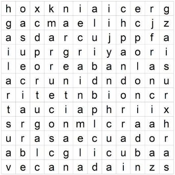

# Alphabet Soup
## Objectives
- Learn to implement the ADT Trie.
- Learn to use a Trie to solve a word search.
- Learn to use the std::map type
- Learn to use the std::pair type
- Learn to use the std::stack type

## Description
A Trie is a multipath tree specialized in retrieving stored keys based on prefixes. In a Trie, every node (except the root) represents a key prefix formed by the path from the root of said node and the subtree that has said node as its root stores all the keys that have as a prefix the one defined by the root node. 

### Use of the Trie
Let's take advantage of this quality to efficiently solve a letter search. 

A letter search is a type of puzzle formed by a grid. filled with letters, so that a number of known words are contained in the grid following a linear sequence of boxes and the rest of the boxes are filled with letters at random. The game consists of locating the words in the shortest time possible.


To solve the alphabet soup, the first thing we have to do is create a Trie by inserting the list of words to search for as keys of the Trie.
The second would be to go through the grid (by rows and columns), consulting in the Trie whether the letter of said grid is a prefix of some of some key. If so, we apply the algorithm model  that recursively scans the table following a key prefix.

```cpp
Algorithm scanCell(row:Int, col:Int, dx:Int, dy:Int,TrieNode node soup:AlphabetSoup, result:Pair[String, Stack[Pair[Int,Int]]])
/*
1. If this node is a leaf node(Leafnodeshasvalue!="").
    1.1 Save the word in the first item of the scan_result pair and finish recursion.
2. Else, we can have tree cases.
    2.1.1 Thisisthefirstletterofword(dx==dy==0).
    Scan for all the 3x3 neighbourhood for the next letter.
    2.2.1 We’ve have a prefix, so we need scan the next letter in the direction (dy,dx) if this letter is child of this node (recursion). Elsereturn not found result.first = “”)
    2.3 if a word was found(first item of the scan_resultpair!=""),we push the current cell's coordinates [row,col] in to the second item of scan_result.*/
```

So if we use the sop , when we study the cell (9,5) with value 'e', we will find that it is a key prefix ('equator') and we will call our cell scanning algorithm dy=0, dx=0 and node trie.root().child(soup[9][5]). This way we will proceed to scan now for the range rows=(8,9,5) x cols=(4,5,6). In this process the cell (9,6) with value 'c' is a child of the node for the prefix 'e', so the algorithm is recursively applied to this node (prefix 'ec') in the cell (9,6) with dy=(9-9)=0 and dx=(6-5)=1. Note how from the first letter found, (dy ,dx) indicates and the direction to follow for the rest of the word, that is, now in this node (prefix 'ec') only the cell is studied (9+dy=9,6+dx=7) and the process is repeated until it reaches a leaf node that represents the key “equator”.

## Tests
- Trie
- Retrieve
- Alphabet Soup