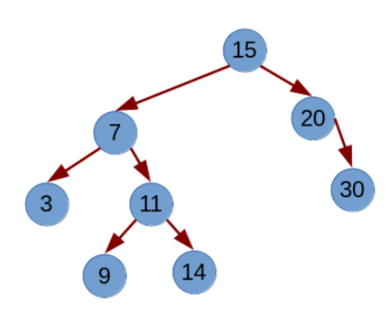

# Binary Tree
## Objectives
- Implement a linked version of the Binary Tree ADT.
- Implement utility functions in a tree:
    - Calculation of the height and size of a tree.
    - Depth traversal.
    - Width traversal.
- Implement “in order” operations on the binary tree.

## Description
Develop a link implementation of the ADT Binary Tree and various operations on the binary tree, such as folding/unfolding the tree, calculating the height and size of the tree, and depth and width traversals. 

### Examples
To fold a tree, the following grammar will be used.

```
‘[]’ if empty
‘[ ‘<T>‘ ’<BTree[T] left>‘ ’<BTree[T] right>’ ]’
```

Thus given the tree:


The folded output should be:

```
[ 15 [ 7 [ 3 [] [] ] [ 11 [ 9 [] [] ] [ 14 [] [] ]] ] [ 20 [] [30 [] [] ] ] ]
```

It has a height equal to 3.

On the other hand, the prefix, infix, postfix and width paths given the previous tree would be (there is space at the end of each line): 


*15 7 3 11 9 14 20 30 <br>
3 7 9 11 14 15 20 30 <br>
3 9 14 11 7 30 20 15 <br>
15 7 20 3 11 30 9 14*

In addition, the indicated tree is in order, since traversing the tree in order generates an ordered sequence of nodes. If the tree is in order, inserting the new value 15 implies creating a new node as the left child of node 20.

## Tests
- BTree
- Traversals
- Inorder